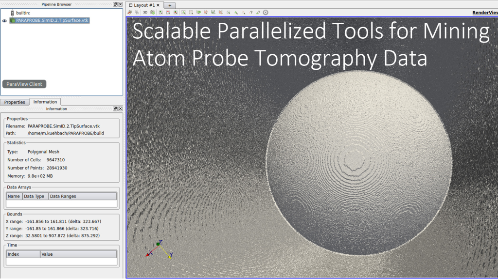

..   :scale: 20%
..   :align: left
..   :target: https://github.com/mkuehbach/PARAPROBE
      
| PARAPROBE is an MPI/OpenMP-parallelized open source back end tool for
| running strong scaling analyses of Atom Probe Tomography (APT) data.

| The tool is developed by Markus_ Kühbach, a scientific computing Postdoc 
| with the Max-Planck BiGmax_'s research network at the Max-Planck Institut,
| für Eisenforschung (MPIE_) in Düsseldorf.

| Please feel free to utilize the tool. In doing so, feel equally free 
| to suggest me_ any improvements or desirable analysis features 
| you find useful to add into PARAPROBE.

 .. _Markus: https://bigmax.iwww.mpg.de/39151/bigmax-software-engineering-consultant
 .. _BiGmax: https://www.bigmax.mpg.de/
 .. _MPIE: https://www.mpie.de
 .. _me: https://www.mpie.de/person/51206/2656491

1. Getting started
^^^^^^^^^^^^^^^^^^

.. toctree::
   :maxdepth: 2
     
   basics
   setup
   
2. Utilize productively
^^^^^^^^^^^^^^^^^^^^^^^
   
.. toctree::
   :maxdepth: 2

   .. gui
   input
   executing

3. Examples
^^^^^^^^^^^

.. toctree::
   :maxdepth: 2

   tutorials

4. Version history
^^^^^^^^^^^^^^^^^^

.. toctree::
   :maxdepth: 2

   changelog
   licence

5. References
^^^^^^^^^^^^^

.. toctree::
   :maxdepth: 2

   refs

6. Funding
^^^^^^^^^^
| The author gratefully acknowledges the support from the Deutsche 
| Forschungsgemeinschaft (DFG_) through project BA 4253/2-1 and the 
| provisioning of computing resources by the Max-Planck Gesellschaft.

 .. _DFG: https://www.dfg.de/

 
7. Questions, contributions
^^^^^^^^^^^^^^^^^^^^^^^^^^^
Please feel free to contact me_
